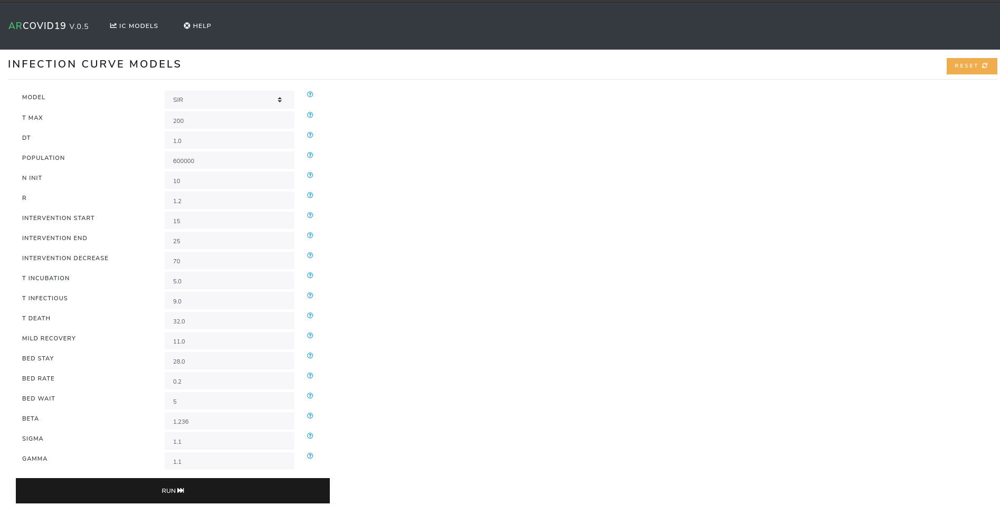

Web Tutorial
============

Arcovid19 presents a tool for the online visualization of epidemiological models.

The simplest way to execute this application is simply to run

.. warning::

    This is a test server, and should not be used in a production environment for any reason.

.. code-block:: console

    $ arcovid19 webserver
    * Serving Flask app "arcovid19.web" (lazy loading)
    * Environment: production
    WARNING: This is a development server. Do not use it in a production deployment.
    Use a production WSGI server instead.
    * Debug mode: on
    * Running on http://127.0.0.1:5000/ (Press CTRL+C to quit)
    * Restarting with inotify reloader
    * Debugger is active!
    * Debugger PIN: XXX

This launches a **local** application which you can access through the url ``http://localhost:5000``.

    Default view of arcovid19 webclient in version 0.5.

If for some reason it is necessary to launch the app in another *IP* or *port*, this can be specified with the options ``--host`` and ``--port`` respectively. For example, if you want to serve the local network on port *8000* the command would be

.. code-block:: console

    $ arcovid19 webserver --host 0.0.0.0 --port 8000
    * Serving Flask app "arcovid19.web" (lazy loading)
    * Environment: production
    WARNING: This is a development server. Do not use it in a production deployment.
    Use a production WSGI server instead.
    * Debug mode: on
    * Running on http://0.0.0.0:8000/ (Press CTRL+C to quit)
    * Restarting with inotify reloader
    * Debugger is active!
    * Debugger PIN: 242-079-243

This would allow anyone connected to the same local network as the computer where the web application is started to access the website via the server's IP and port *8000*.

.. note::

    For more web server options you can execute the command
    ``arcovid19 webserver --help``.

Cambiando de idioma
-------------------

So far arcovid19 web only has two languages implemented.

#. ``en`` - Ingles (Activated by default)
#. ``es`` - Español.

To activate the alternative language, you must assign a
`environment variable <https://en.wikipedia.org/wiki/Environment_variable>`_.
called ``ARCOVID19_DEFAULT_LOCALE``.

This is done with the command

.. code-block:: console

    $ export ARCOVID19_DEFAULT_LOCALE=es;

After that, it is simply a matter of launching the application with
``arcovid19 werbserver``.

Deployment
----------

To run arcovid19 webserver in a production environment at least 2 environment variables must be configured:

- ``ARCOVID19_DEBUG=false``
- ``ARCOVID19_SECRET_KEY=a-lot-of-random-chars``

*ARCOVID19_SECRET_KEY* has to be a contiguous random string of random values, you can, for example, press keys without any sense.

If you want to configure the language to Spanish, you must export the environment variable

- ``ARCOVID19_DEFAULT_LOCALE=es``

Deployment can be done with any available method to
`Flask <https://flask.palletsprojects.com/en/1.1.x/deploying/>`_, and the 
wsgi application is available with the function  ``arcovid19.web.create_app()``.

For example, to launch the application with `Gunicorn <https://gunicorn.org/>`_
can be done with the command

.. code-block:: console

    $ gunicorn 'arcovid19.web:create_app()'

In addition, the repository is already configured with the files 
*requirements.txt* and *Procfile* to work in `Heroku <http://heroku.com>`_.

An online version of the webapp is available in
`here <https://arcovid19.herokuapp.com/>`_.

